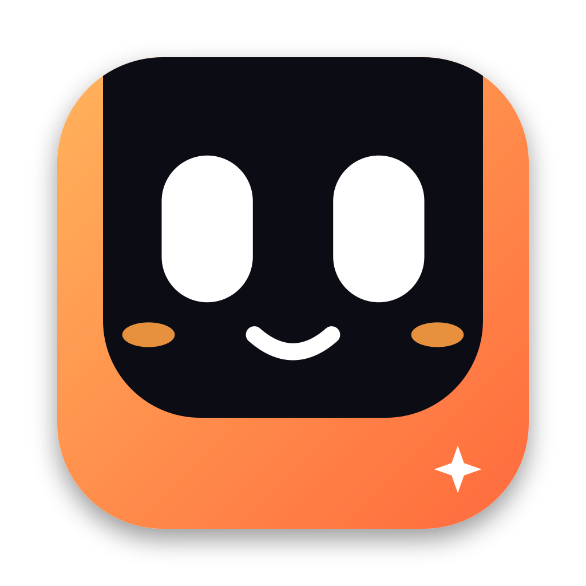

<p align="center">
  
</p>

<h1 align="center">Tibo</h1>
<p align="center"><strong>Trợ lý giọng nói sống ngay trên notch của Mac.</strong><br>Nói một câu, gõ một lệnh, hoặc hỏi về thứ đang hiện trên màn hình.</p>

<p align="center">
  <a href="#bat-dau">Bắt đầu</a> &nbsp;·&nbsp;
  <a href="#tibo-lam-duoc-gi">Khám phá</a> &nbsp;·&nbsp;
  <a href="#cach-hoat-dong">Cách hoạt động</a> &nbsp;·&nbsp;
  <a href="#luu-y">Lưu ý</a>
</p>

---

<table>
<tr>
<td width="24%" align="center" valign="middle"></td>
<td valign="middle"><strong>Gặp Tibo ở notch.</strong><br>Di chuột tới notch để mở, gõ câu hỏi hoặc nhấn mic để nói. Tibo nghe, phản hồi bằng giọng nói và giúp bạn làm việc trên máy. Gõ <code>/</code> để xem lệnh nhanh.</td>
</tr>
</table>

<a id="tibo-lam-duoc-gi"></a>
## Một trợ lý, nhiều cách làm việc

| Nói chuyện | Nhìn màn hình | Làm việc cùng agent |
| :--- | :--- | :--- |
| Gọi “Tibo”, dùng mic hoặc nhập chữ. Có chế độ tự gửi khi ngừng nói, ngắt lời và trả lời bằng giọng macOS; Kokoro tiếng Việt khi đã cài. | Đọc chữ trên màn hình bằng OCR; chuyển ảnh màn hình cho agent có khả năng xem ảnh khi cần. Quyền Ghi màn hình được macOS hỏi riêng. | Chọn **pi, OMP, Claude Code hoặc Codex** đã cài. Giao việc coding, hỏi tiến độ, xem kết quả; việc giao tác vụ coding có bước xác nhận trước khi khởi chạy. |

Tibo còn có các quy trình cho lịch, ghi chú, nhắc việc, thời tiết và trình duyệt. Câu trả lời thông thường không cần cấp quyền chạy lệnh cho agent.

<a id="bat-dau"></a>
## Bắt đầu trên macOS

**Cần có:** macOS, Xcode Command Line Tools (`xcode-select --install`), Rust/Cargo và ít nhất một CLI agent tương thích đã được cài, đăng nhập/cấu hình model. `pi` là lựa chọn mặc định; màn hình thiết lập sẽ cho chọn agent có trên máy. Apple Speech và giọng hệ thống macOS dùng được khi chưa cài Whisper hoặc Kokoro.

```sh
git clone https://github.com/lukebaze/Tibo.git
cd Tibo
./build.sh
open Tibo.app
```

`build.sh` biên dịch Rust + Swift, tạo `dist/Tibo.dmg`, **thay** `~/Applications/Tibo.app` và chép `tibo`, `tibo-web` vào `~/.local/bin/`. Nếu máy có chứng chỉ Apple Development/Developer ID, script dùng để ký app; nếu không, nó ký ad-hoc. Hãy xem script trước khi chạy nếu bạn đã cài một bản Tibo khác.

Trong thiết lập lần đầu:

1. Chọn agent/model và cách nghe: gọi “Tibo”, bấm mic kiểu Smart hoặc bấm để gửi.
2. Chọn Apple Speech, hoặc tải model Whisper trong app nếu muốn nhận dạng giọng nói bằng model trên máy. Chọn giọng hệ thống; Kokoro chỉ hiện khả dụng khi đã cài voicepack.
3. Cấp Microphone, Speech Recognition; chỉ cấp Ghi màn hình/Trợ năng khi muốn Tibo đọc hoặc điều khiển máy.
4. Di chuột tới notch và thử: **“Tibo, hôm nay tôi nên làm gì?”**

Chẩn đoán môi trường sau khi build: `~/.local/bin/tibo --doctor`.

<a id="cach-hoat-dong"></a>
## Cách hoạt động

```text
Giọng nói / bàn phím
        ↓
   Tibo trên notch ──→ nhận dạng giọng nói (Apple Speech / Whisper)
        ↓
   Định tuyến yêu cầu ──→ kiểm tra quyền / xác nhận khi cần
        ↓
   Tác vụ macOS / màn hình / coding agent
        ↓
   Phản hồi trên notch + giọng đọc
```

App giao diện viết bằng **SwiftUI/AppKit**; phần định tuyến, phiên làm việc, bộ nhớ và xử lý lời nói ở **Rust**. Agent CLI chạy trên chính máy Mac của bạn. Cấu hình model, dịch vụ AI và quyền truy cập tùy chọn quyết định phần nào hoạt động được; “chạy cục bộ” không có nghĩa mọi lời gọi model đều offline.

<a id="luu-y"></a>
## Quyền riêng tư &amp; giới hạn

- Tibo có thể đọc màn hình và điều khiển macOS **sau khi được cấp quyền tương ứng**. Xem kỹ yêu cầu xác nhận trước khi giao việc có tác động đến máy hoặc tệp.
- Một số quy trình dùng agent CLI có khả năng chạy shell; chỉ chạy quy trình mà bạn tin tưởng. Đừng coi xác nhận trong app là sandbox bảo mật cho các CLI bên ngoài.
- Model Whisper tải từ bên ngoài khi bạn chọn tải; Apple Speech là đường mặc định nếu chưa có model. Các agent/model từ xa có thể gửi nội dung yêu cầu ra dịch vụ của chúng.
- Ảnh biểu tượng `app/icon.svg` là thiết kế riêng cho Tibo. Một số ảnh động trong `app/taby/` là artwork của **Taby**, có điều khoản và ghi công riêng tại [`app/taby/LICENSE`](app/taby/LICENSE); không được trình bày chúng như nhân vật gốc do Tibo tạo ra.

<details>
<summary><strong>Dành cho người muốn sửa code</strong></summary>

`app/` chứa giao diện macOS, `src/` chứa backend Rust, `workflows/` chứa quy trình, `scripts/` chứa cầu nối giọng nói và `bench/` chứa dữ liệu benchmark. Chạy `cargo test` cho phần Rust; `./build.sh` để đóng gói app trên macOS. Script build cũng ghi đè bản cài trong `~/Applications/`, nên không chạy nó chỉ để kiểm tra một thay đổi Markdown.

</details>

<p align="center"><sub>Made for the Mac you already use. Nói “Tibo” là bắt đầu.</sub></p>
