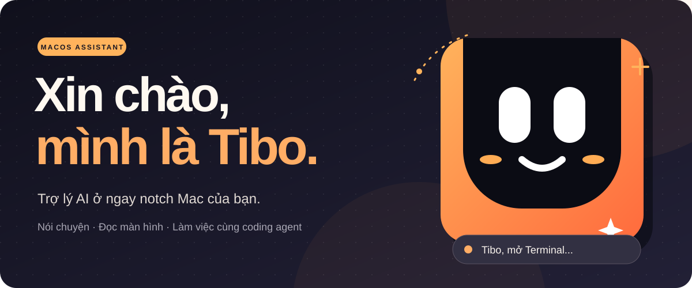

<p align="center">
  
</p>

# Tibo

Tibo là trợ lý giọng nói ở notch Mac. Bạn có thể gọi tên Tibo hoặc bấm mic để
hỏi đáp, đọc màn hình và giao việc cho coding agent đã cài trên máy.

Trang này giúp bạn **build Tibo từ mã nguồn và thử câu đầu tiên**. Chưa cần
cài Whisper hay Kokoro: lần đầu có thể chọn Apple Speech và giọng macOS.

## Trước khi bắt đầu

- Dùng máy Mac có Xcode Command Line Tools và Rust/Cargo. Nếu chưa có Command
  Line Tools, chạy `xcode-select --install` và hoàn tất cửa sổ cài đặt.
- Cài và cấu hình ít nhất một CLI agent: pi, OMP, Claude Code hoặc Codex. Tibo
  mặc định chọn pi, nhưng cho đổi sang agent đã có trên máy.
- Đọc [`build.sh`](build.sh) nếu bạn đã cài Tibo: script **thay**
  `~/Applications/Tibo.app`, chép CLI vào `~/.local/bin/` và tạo
  `dist/Tibo.dmg`. Bản build sẽ được ký bằng chứng chỉ có sẵn hoặc ký ad-hoc.

## 1. Lấy mã nguồn và build

```sh
git clone https://github.com/lukebaze/Tibo.git
cd Tibo
mkdir -p "$HOME/Applications" "$HOME/.local/bin"
./build.sh
```

Sau khi build xong, kiểm tra `Tibo.app` và `dist/Tibo.dmg` trong thư mục repo.
Không cần chạy lại `build.sh` để mở ứng dụng.

## 2. Mở và thiết lập

```sh
open Tibo.app
```

Trong màn hình thiết lập:

1. Chọn agent đã cài và cấu hình model/tài khoản của agent đó.
2. Chọn cách nghe. Để bắt đầu nhanh, chọn **Apple Speech** và **Giọng hệ thống
   macOS**. Whisper cần tải model khi bạn chọn; Kokoro chỉ dùng được khi đã
   cài voicepack.
3. Cho phép Microphone và Speech Recognition nếu muốn nói với Tibo. Chỉ cấp
   Ghi màn hình khi dùng tính năng đọc màn hình; chỉ cấp Trợ năng khi cần
   điều khiển máy.

## 3. Thử một câu

Nói **“Tibo, chào bạn”** ở chế độ gọi tên hoặc bấm mic ở chế độ bấm để nói.
Tibo sẽ hiện câu trả lời ở notch; giọng đọc phụ thuộc cài đặt bạn vừa chọn.
Dòng dưới Buddy cho biết Tibo đang nghe, nhận dạng, suy nghĩ, làm việc hay gọi công cụ; nói “Tibo” lần nữa để bắt đầu yêu cầu mới.

Nếu không thấy phản hồi, kiểm tra agent bạn chọn đã đăng nhập/cấu hình model.
Nếu mic không hoạt động, xem quyền Microphone và Speech Recognition trong
System Settings. Mục **Chẩn đoán** trong Cài đặt Tibo chạy `tibo --doctor`;
lệnh này kiểm tra cả Whisper, VietASR và Kokoro tùy chọn, nên có thể báo
`DOCTOR FAIL` dù chế độ Apple Speech vẫn hoạt động.

## Computer use: Tibo làm được gì?

- **Mở app** theo tên (“Tibo, mở Safari”), không tự điều khiển mọi cửa sổ.
- **Đọc màn hình chính** bằng OCR; câu hỏi về ảnh/biểu đồ có thể gửi kèm ảnh cho agent hỗ trợ thị giác. Cần quyền Ghi màn hình; chỉ hoạt động trong app Tibo.
- **Duyệt Chrome theo câu lệnh** (“Tibo, tìm kiếm web về trí tuệ nhân tạo”, “truy cập Wikipedia đọc bài này”): sau **một lần Xác nhận**, Tibo chạy thẳng Jev Ultrafast để tự tìm, bấm, gõ và cuộn, rồi mở trang cuối cho bạn xem; không cần Pi diễn giải lại lệnh. Cần cài `~/jev-ultrafast`; không tự đăng nhập, thanh toán, đặt hàng, gửi tin nhắn hoặc xoá.
- **Tác vụ Mac khác** qua workflow: nhắc việc, lịch, ghi chú, hẹn giờ, nháp email (không gửi), clipboard, thời tiết và bản tin. Helper `workflows/mac.js` có `reminders-add`, `reminders-list`, `calendar-add`, `calendar-list`, `notes-add`, `timer`, `mail-draft`.

**Không có computer-use tuỳ ý**: ngoài app, đọc màn hình và workflow đã cấu hình, yêu cầu GUI chưa hỗ trợ sẽ không được âm thầm chuyển thành thao tác máy. Chi tiết từng function, quyền và giới hạn: [Computer use hiện có](docs/computer-use.md).

## Khi giao việc cho Tibo

Tác vụ coding cần xác nhận trước khi khởi chạy. Một số quy trình sử dụng CLI
agent có thể chạy shell trên Mac; xem kỹ nội dung tác vụ trước khi đồng ý.

Khi Tibo hỏi phê duyệt, nói hoặc bấm **Xác nhận**/**Huỷ** trong notch; câu mơ
hồ như “đúng” không phê duyệt thao tác. Tibo mở được ứng dụng và chạy các quy
trình đã cấu hình, nhưng không nhận điều khiển GUI tuỳ ý qua OMP: nếu không có
quy trình phù hợp, Tibo báo chưa hỗ trợ thay vì yêu cầu xác nhận rồi thất bại.

Quyền macOS và xác nhận trong Tibo không phải sandbox bảo mật cho agent ngoài.
Model/agent từ xa có thể gửi nội dung yêu cầu tới dịch vụ của chúng.

## Dùng Tibo để chọn thao tác trong Jevcast

`tibo --computer-plan` đọc một JSON từ stdin gồm `query` và danh sách
`candidates` (`id`, `title`, `detail`), rồi trả `{"id":"..."}` hoặc
`{"id":null}` trên stdout. Lệnh chỉ **đề xuất một ID có trong danh sách**;
không chạy lệnh, nhấp chuột hay tự cấp quyền. Cần `TYPESAFE_API_KEY` (khóa
`sk-or-` dùng OpenRouter); nội dung câu hỏi và tên các lựa chọn được gửi
đến dịch vụ Jev. Khi thiếu khóa, đầu vào sai hoặc Jev lỗi, lệnh thất bại
thay vì thực thi. [Jevcast](https://github.com/RyanErkal/jevcast) giới hạn
danh sách ở các thao tác GUI có sẵn và yêu cầu xác nhận trước khi chạy.

## Xem thêm

- [Brandkit Tibo](.github/tibo-brandkit.webp) là bảng định hướng hình ảnh;
  [icon gốc](app/icon.svg) là biểu tượng đang dùng trong app.
- Ảnh động ở `app/taby/` là artwork của Taby, không phải nhân vật gốc của
  Tibo. Xem [điều khoản và ghi công](app/taby/LICENSE).
- Muốn sửa backend Rust, chạy `cargo test`. `./build.sh` đóng gói cả ứng dụng
  macOS và ghi đè bản cài trong `~/Applications/`.
